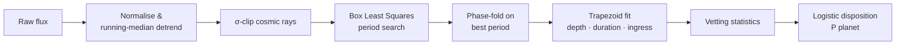

<div align="center">

# 🛰️ TransitVetter

### Is that dip a planet — or an impostor?

**A browser-native Kepler light-curve vetting pipeline.**
Detrend → Box Least Squares → phase-fold → trapezoid fit → NASA-style vetting tests → disposition, all in pure TypeScript, with no server, no upload and no trained model.

[](https://react.dev)
[](https://www.typescriptlang.org)
[](https://vite.dev)
[](https://tailwindcss.com)
[](#-privacy--offline)

</div>

---

## ✨ What it does

You give TransitVetter a light curve — a star's brightness measured over time. It finds the periodic dips, measures their shape, and then runs the same diagnostic tests NASA's Kepler team used to separate **confirmed planets** from **eclipsing binaries, blends and noise**. Everything happens inside your browser tab, in a Web Worker, in under a second.

| | Feature |
|---|---|
| 🔭 | **8 built-in Kepler targets** — four confirmed planets (Kepler-7 b, 10 b, 8 b, 138 d) and four classic false positives, synthesised from published parameters. Can you spot which is which before the classifier does? |
| ⇪ | **Upload or paste your own data** — CSV / TSV / whitespace tables, including raw MAST exports with `TIME, PDCSAP_FLUX` columns. Big files are auto-binned so the search stays interactive. |
| ⚙️ | **Transit simulator** — dial in period, depth, duration, U-vs-V shape, noise, secondary eclipse, odd/even mismatch and starspot variability, then watch the verdict flip in real time. |
| 📈 | **Full BLS periodogram** — a real Box Least Squares implementation over a physically-spaced frequency grid, not a peak-picker. |
| ✅ | **Explainable verdicts** — every test reports pass / warn / fail, its numeric evidence and its exact contribution to the final probability. No black box. |
| 🪐 | **Derived physics** — planet radius, semi-major axis, equilibrium temperature, insolation, planet class and habitable-zone standing. |
| 🎨 | **Image-generation prompt** — turns the measured physical parameters into a ready-to-paste prompt for Midjourney / DALL·E / Stable Diffusion. |
| 🔒 | **Zero backend** — your data never leaves the machine. Builds to a single self-contained HTML file. |

---

## 🚀 Quick start

```bash
git clone https://github.com/Ash1nSky/TransitVetter.git
cd TransitVetter
npm install
npm run dev          # http://localhost:5173
```

```bash
npm run build        # -> dist/index.html  (single self-contained file, thanks to vite-plugin-singlefile)
npm run preview      # serve the production build locally
```

Requires Node 18+. There is nothing else to configure — no API keys, no database, no Python.

---

## 🔭 KIC-only resolver

Don't want to hunt through catalogues for stellar parameters? Open **Upload / paste** and type an identifier into the resolver box:

```
6922244        KIC id (with or without the "KIC " prefix, leading zeros fine)
Kepler-10 b    Kepler planet name
KOI-97.01      KOI designation (K00097.01 also works)
```

TransitVetter fills in the rest — **host-star radius, mass and effective temperature**, plus the published **period, transit depth and duration** — and writes the stellar values straight into the analysis boxes.

Two lookup layers, in order:

1. **Bundled catalogue** — the 26 teaching targets in `src/lib/keplerTargets.ts`. Instant, works with **no network**.
2. **NASA Exoplanet Archive (live)** — a TAP query against the cumulative KOI table, run from your browser. Covers all ~9,500 KOIs. If you're offline or the request is blocked, the app says so and falls back to layer 1.

From the result card you can **fill the star parameters**, **analyse an archive model** (a light curve synthesised from the published period/depth/duration, so you can watch the pipeline run immediately), copy the KIC or a ready-made Lightkurve snippet, and jump to the NASA Time Series Viewer, the MAST FITS tree or the official KOI record. NASA's disposition stays hidden behind a *Reveal* button so you can vet the signal yourself first.

> The archive model is a **model**, not real photometry — it reproduces the catalogued transit shape. For genuine data, use the download links and drop the CSV into the upload box.

---

## 🛸 Getting real Kepler data

Every Kepler observation is public and free. The app reads **plain text tables**, so archive `FITS` files need one conversion step (four lines of Python, below).

| Source | What you get | Link |
|---|---|---|
| **MAST — Kepler Data Search** | The official archive. Search by KIC ID, target name or coordinates; download quarterly light curves. | [archive.stsci.edu/kepler/data_search](https://archive.stsci.edu/kepler/data_search/search.php) |
| **exo.MAST** | Type a planet name (“Kepler-7 b”), preview the light curve in-browser, export the time series. | [exo.mast.stsci.edu](https://exo.mast.stsci.edu/) |
| **NASA Exoplanet Archive — KOI table** | ~9,500 Kepler Objects of Interest with official dispositions **and** the stellar radius / mass / Teff you need to enter. | [Cumulative KOI table](https://exoplanetarchive.ipac.caltech.edu/cgi-bin/TblView/nph-tblView?app=ExoTbls&config=cumulative) |
| **Lightkurve (Python)** | The easiest route: search, stitch and export any Kepler / K2 / TESS target straight to CSV. | [lightkurve.github.io](https://lightkurve.github.io/lightkurve/) |
| **MAST bulk directory** | Raw HTTP tree of every public Kepler light curve, organised by KIC ID — ideal for `wget`. | [archive.stsci.edu/pub/kepler/lightcurves](https://archive.stsci.edu/pub/kepler/lightcurves/) |
| **Kaggle mirror** | Offline copy of the KOI catalogue if you just want labelled parameters without an archive query. | [Kepler exoplanet search results](https://www.kaggle.com/datasets/nasa/kepler-exoplanet-search-results) |

### FITS ➜ CSV in four lines

```python
# pip install lightkurve
import lightkurve as lk

lc = (lk.search_lightcurve("Kepler-8", mission="Kepler", cadence="long")
        .download_all()
        .stitch()
        .remove_nans())

lc.to_csv("kepler8.csv")   # -> time, flux  (drop straight into TransitVetter)
```

> **Tips for good results**
> * Prefer **PDCSAP flux** — instrumental systematics already removed.
> * **Long cadence** (29.4 min) is plenty; short cadence just makes the file bigger.
> * Use **≥ 30 days of baseline** so at least three transits land in the window — the pipeline requires three to trust a period.
> * Fill in the host star's **radius, mass and Teff** (the KOI table lists them). They set the planet radius, temperature and the duration-consistency test.

### Accepted input format

```
time,flux
131.512,1.000212
131.532,0.999871
...
```

* Delimiters: comma, tab, semicolon or whitespace.
* Lines starting with `#` or `\` are ignored (IPAC/ASCII headers are fine).
* Header auto-detection prefers `PDCSAP_FLUX`, then `SAP_FLUX`, then any `*flux*` column; time matches `time` / `t` / `bjd` / `bkjd`.
* Flux may be in raw electrons/second — it is normalised by its median.
* Files over 14,000 rows are averaged down in bins, with the binning factor reported back to you.
* A **template CSV** can be downloaded from the Upload tab if you want a reference file.

---

## 🔬 How the classifier works

> Short answer to the obvious question: **you do not need a neural network to vet a transit signal.** Period detection is a solved mathematical problem (BLS), and the vetting can be done with physically motivated tests — which is exactly how the official Kepler DR25 catalogue was produced.

### The pipeline



| # | Stage | Method | What it does |
|---|---|---|---|
| **01** | Normalise & detrend | Running-median filter, 1-day window | Divide flux by its median, then by a sliding median. Starspot modulation and instrumental drift (days) are flattened; transits (hours) survive untouched. Positive 4σ outliers (cosmic rays) are clipped. |
| **02** | Box Least Squares | Kovács, Zucker & Mazeh (2002) | For thousands of trial periods, fold the data and slide a box of each trial duration across the phase. Power ∝ `depth² · n_in · n_out / N`. The frequency grid is spaced so accumulated phase drift stays below a fraction of the shortest transit; phase bins are ~20 minutes wide regardless of period, so short transits are never smeared. Periods are capped at `baseline / 3` — the Kepler "three transits" rule. No training required. |
| **03** | Trapezoid fit | Grid least-squares on the binned phase curve | Fits depth, total duration and **ingress fraction**. The ingress fraction is what separates flat-bottomed **U-shaped** planetary transits from **V-shaped** grazing stellar eclipses. |
| **04** | Vetting statistics | SNR/MES, SDE, odd/even Δ, secondary depth, duration ratio, sine-vs-box | The diagnostics the Kepler Robovetter applies: is the signal significant, is it transit-shaped rather than sinusoidal, are alternating transits equal, is there a dip at phase 0.5, is the implied radius planetary, is the duration consistent with the stellar density? |
| **05** | Logistic disposition | `σ(Σ wᵢ · testᵢ)` | Each test contributes a signed weight; a sigmoid converts the sum into P(planet). A single hard failure caps the probability, mirroring Robovetter semantics. |

### The seven vetting tests

Every run reports each test with its evidence and logit weight. Starting prior: **+0.8** (roughly half of Kepler KOIs turn out to be planets).

| Test | Fails when | Why it matters | Weight range |
|---|---|---|---|
| **Transit significance** | SNR < 7.1σ or SDE < 6 | Kepler's official detection threshold. Below it, the "signal" is noise or stellar variability. | −4.0 … +2.0 |
| **Transit-like shape** | A sinusoid fits >15% better, duty cycle > 15%, or flux *rises* at phase 0.5 | Starspot rotation, pulsation and ellipsoidal variation are smooth; real transits are boxy and brief. | −3.5 … +0.5 |
| **Three transits minimum** | Fewer than 3 events folded | With one or two events the period is unconstrained — it could be any multiple. | −1.2 … +0.2 |
| **Planetary radius** | R > 25 R⊕ (fail) or > 18 R⊕ (warn) | `depth = (Rp/R★)²`. A companion bigger than any inflated planet is a star or brown dwarf. | −4.0 … +0.6 |
| **Odd/even consistency** | Depths differ by > 3σ | Alternating deep/shallow eclipses mean two different stars — the true period is 2× the detected one. | −3.0 … +0.5 |
| **No secondary eclipse** | Dip at phase 0.5 significant at > 3.5σ | A self-luminous companion being occulted ⇒ eclipsing binary or background blend. | −3.0 … +0.5 |
| **Duration vs stellar density** | Measured/expected ratio > 2.5 or < 0.15 | `T ≈ 13 h · (P/1 yr)^⅓ · R★ / M★^⅓`. A mismatch means the eclipse is happening on a different, larger star. | −1.5 … +0.3 |

Plus **shape** as a soft discriminator: U-shaped `+0.6`, intermediate `−0.3`, V-shaped `−1.4`.

### From score to verdict

```
logit  = 0.8 + Σ wᵢ
P      = 1 / (1 + e^−logit)
if any hard failure:  P = min(P, 0.3 / n_failures)
```

| P(planet) | Verdict |
|---|---|
| ≥ 0.62 | 🟢 **PLANET** |
| 0.40 – 0.62 | 🟡 **CANDIDATE** — needs centroid analysis, radial velocities or high-resolution imaging |
| ≤ 0.40 | 🔴 **FALSE POSITIVE** — with a diagnosed type: grazing EB, EB at 2× period, background blend, stellar variability, … |

### Derived physics

Once a signal survives vetting, the measured depth and period plus the host-star parameters give:

```
Rp   = √depth · R★ · 109.2            [Earth radii]
a    = (M★ · P_yr²)^⅓                 [AU, Kepler's third law]
Teq  = T★ · √(R★ / 2a) · (1 − A)^¼    [K, Bond albedo A = 0.3]
S    = R★² · (T★/5778)⁴ / a²          [Earth insolation]
```

…which in turn drive the planet classification (rocky / super-Earth / sub-Neptune / hot Jupiter / …), the habitable-zone verdict and the generated image prompt.

<details>
<summary><b>Do we need a trained AI model? — three approaches compared</b></summary>

<br/>

**1. Pure mathematics (what runs in this app)**
- BLS / TLS periodograms find the signal analytically.
- Physics provides the discriminants: Kepler's third law, stellar density → duration, depth → radius.
- Threshold-based vetting is exactly what produced the Kepler DR25 catalogue (Robovetter).
- Transparent, explainable, works on a single light curve with **no training set**.
- Weakness: hand-tuned thresholds; no learned handling of exotic systematics.

**2. Classical ML on extracted features**
- Take the metrics computed above (SNR, depth, duration, odd/even, secondary…) as a feature vector.
- Train a random forest / gradient boosting / logistic regression on the labelled KOI table (~8,000 dispositioned objects, free at the NASA Exoplanet Archive).
- This is the "Autovetter" approach (McCauliff et al. 2015); ~95% accuracy.
- Cheap to train (seconds) and can run in-browser via ONNX / TF.js.

**3. Deep learning on the raw light curve**
- 1-D CNN on the phase-folded *global* + *local* views (AstroNet — Shallue & Vanderburg 2018), which discovered Kepler-90 i.
- Needs ~15k labelled folded curves plus augmentation; best at odd systematics and shallow signals.
- Still requires BLS first to find the period — deep learning replaces only the vetting stage.
- Less interpretable; overkill for a handful of objects, excellent for a whole survey.

**Bottom line:** a trained model becomes worthwhile when you want to process thousands of targets at maximum completeness. The natural upgrade path here is to feed the feature vector this app already computes into a classifier trained on the Kepler DR25 KOI catalogue — the weights in `classify()` are hand-set from physics, and swapping them for learned coefficients requires *zero* architectural change.

</details>

---

## 🗂️ Project structure

```
src/
├── App.tsx                     Layout, pipeline orchestration, animated transit hero
├── lib/
│   ├── lightcurve.ts           Data model, seeded simulator, sample catalogue, text parser
│   ├── keplerTargets.ts        26 real Kepler targets + archive URL builders
│   ├── kicResolve.ts           KIC / KOI / name parsing, catalogue + live NASA TAP lookup
│   ├── analysis.ts             Detrend · BLS · phase-fold · trapezoid fit · metrics · classifier
│   ├── analysis.worker.ts      Runs the pipeline off the main thread
│   └── prompt.ts               Physical parameters → image-generation prompt
└── components/
    ├── DataInput.tsx           Sample targets · upload/paste (+ data-source tips) · simulator
    ├── KicResolver.tsx         Enter a KIC → auto-filled stellar & transit parameters
    ├── RandomRoller.tsx        Random real-target picker with hidden disposition
    ├── ResultPanel.tsx         Verdict, probability, per-test breakdown
    ├── Charts.tsx              Light curve, phase-folded view, BLS periodogram (hand-rolled SVG)
    ├── PlanetVisual.tsx        Procedural planet rendering from derived properties
    ├── PromptGenerator.tsx     Prompt builder UI
    └── Starfield.tsx           Animated background
```

No charting library, no numerical library — the periodograms, fits and plots are all written from scratch.

---

## 🔒 Privacy & offline

The entire pipeline is client-side TypeScript. Uploaded files are read with `FileReader` and analysed in a Web Worker; nothing is transmitted anywhere. The only optional outbound request is the KIC resolver's live NASA Exoplanet Archive lookup, which fires solely when you resolve an id that isn't in the bundled catalogue — skip it and the app never touches the network. `npm run build` emits a single `dist/index.html` you can email, host on a USB stick, or open with no network at all.

---

## 📚 References

- Kovács, Zucker & Mazeh (2002) — *A box-fitting algorithm in the search for periodic transits*
- Thompson et al. (2018) — *Kepler DR25: Planet candidate catalogue and the Robovetter*
- McCauliff et al. (2015) — *Automatic classification of Kepler planetary transit candidates* (Autovetter)
- Shallue & Vanderburg (2018) — *Identifying exoplanets with deep learning* (AstroNet)
- Seager & Mallén-Ornelas (2003) — *A unique solution of planet and star parameters from a transiting planet light curve*

Data courtesy of the [NASA Exoplanet Archive](https://exoplanetarchive.ipac.caltech.edu/) and the [Mikulski Archive for Space Telescopes (MAST)](https://archive.stsci.edu/kepler/).

---

<div align="center">

*Sample light curves are synthesised from the published parameters of real Kepler objects — they are realistic teaching data, not archival photometry. Bring your own files for the real thing.*

</div>
